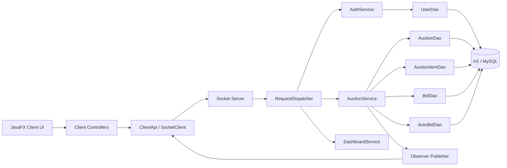

# AuctionHub Online Auction

AuctionHub là đồ án đấu giá trực tuyến theo hướng **OOP + MVC + Client-Server**, dùng **Java 21**, **JavaFX + FXML** cho client, **socket server** cho realtime, **JDBC** cho persistence, và **H2/MySQL** cho lưu trữ.

Mục tiêu của project là tạo ra một bài nộp hoàn chỉnh, dễ build, dễ demo, dễ chấm, đồng thời thể hiện rõ tư duy kiến trúc phần mềm: tách lớp hợp lý, business logic tập trung ở service, client không truy cập DB, có realtime push, có concurrency control, có chatbot hỗ trợ, có logout an toàn, có seed data, test và CI cơ bản.

## 1. Chức năng đã hoàn thiện

### 1.1. Chức năng bắt buộc
- Đăng ký tài khoản với validate dữ liệu.
- Đăng nhập tài khoản và giữ trạng thái đăng nhập ở client session.
- Phân quyền rõ cho `BIDDER`, `SELLER`, `ADMIN`.
- Seller có thể tạo, sửa, xóa, hủy phiên đấu giá.
- Bidder có thể xem phiên, đặt giá, cấu hình auto-bid.
- Admin có dashboard tổng quan, xem user, theo dõi auction và chuyển `FINISHED -> PAID`.
- Tự động chuyển trạng thái `OPEN -> RUNNING -> FINISHED` theo thời gian.
- Khi phiên đóng, hệ thống khóa bid mới.
- Realtime update cho client đang subscribe cùng phiên.
- Xử lý lỗi thân thiện: bid thấp, bid khi phiên đóng, lỗi phân quyền, lỗi kết nối.

### 1.2. Tính năng nâng cao
- Logout an toàn: xóa session, đóng socket listener, quay về login.
- Chatbot rule-based ngay trong app.
- Auto-bid với `maxBid` và `increment`.
- Anti-sniping: bid trong X giây cuối sẽ tự gia hạn thêm Y giây.
- Realtime line chart cho lịch sử giá.
- Dashboard đơn giản theo role.
- Search / filter / sort danh sách auction.
- Seed dữ liệu mẫu để demo ngay.
- CI GitHub Actions chạy test Maven.

## 2. Kiến trúc tổng thể

### 2.1. Luồng client-server
1. **Client JavaFX** khởi động, hiển thị Login/Register.
2. Client mở **socket** tới server khi cần gửi request.
3. Request được đóng gói thành `ApiEnvelope` và gửi dưới dạng JSON line-based.
4. **Server** nhận request qua `AuctionServer` -> `ClientConnection` -> `RequestDispatcher`.
5. Dispatcher gọi **service** phù hợp (`AuthService`, `AuctionService`, `DashboardService`).
6. Service thao tác dữ liệu qua **DAO JDBC** (`UserDao`, `AuctionDao`, `BidDao`, ...).
7. Chỉ **server** truy cập DB.
8. Khi có bid mới hoặc đổi trạng thái, server đẩy **event realtime** qua `SocketAuctionEventPublisher` tới mọi client đang subscribe cùng auction.
9. Client nhận event, cập nhật bảng, chi tiết auction, bid history và chart ngay trên UI.

### 2.2. MVC phía client
- **Model/DTO**: `common.dto.*`, `common.model.*`
- **View**: `src/main/resources/client/fxml/*.fxml`
- **Controller**: `client.controller.*`
- **Service/UI support**: `client.service.*`, `client.network.*`, `client.session.*`

Controller phía client chỉ nhận thao tác UI, gọi `ClientApi`, sau đó bind dữ liệu lên JavaFX controls. Business logic đấu giá nằm ở server.

### 2.3. Phân tầng phía server
- `network`: socket acceptor, client connection, dispatcher.
- `service`: business logic, validation, lifecycle, auto-bid, dashboard.
- `dao`: abstraction cho persistence.
- `dao.jdbc`: JDBC implementation cụ thể.
- `db`: quản lý kết nối và khởi tạo schema/seed.

## 3. OOP và design patterns đã áp dụng

### 3.1. OOP
- **Encapsulation**: entity và session được đóng gói bằng field private + getter/setter + service API rõ ràng.
- **Inheritance**: `User` là abstract base class, có `Bidder`, `Seller`, `Admin`; `AuctionItem` là abstract base class, có `ElectronicsItem`, `ArtItem`, `VehicleItem`.
- **Polymorphism**: `UserFactory` và `AuctionItemFactory` trả về subtype phù hợp; code xử lý qua abstraction `User`, `AuctionItem`.
- **Abstraction**: DAO interfaces (`UserDao`, `AuctionDao`, `BidDao`, ...) tách khỏi JDBC implementation.

### 3.2. Design patterns
- **Singleton**
  - `DatabaseManager`: một nơi duy nhất quản lý JDBC connection factory.
  - `ClientSession` / `ClientContext` / `SceneNavigator`: trạng thái chung phía client.
- **Factory Method**
  - `UserFactory`: tạo `Bidder`, `Seller`, `Admin` theo role.
  - `AuctionItemFactory`: tạo subtype item theo `ItemType`.
- **Observer**
  - `AuctionEventPublisher` + `AuctionEventListener` + `SocketAuctionEventPublisher` cho realtime push.
- **Strategy**
  - `AuctionExtensionStrategy` + `AntiSnipingExtensionStrategy` cho cơ chế gia hạn phiên trong những giây cuối.

## 4. Concurrency, realtime, auto-bid, anti-sniping

### 4.1. Concurrent bidding
- Mỗi auction dùng **per-auction lock** thông qua `AuctionLockManager`.
- Các thao tác nhạy cảm như `placeBid`, `configureAutoBid`, `cancelAuction`, `markAuctionPaid`, `updateAuction`, `deleteAuction` được tuần tự hóa theo từng phiên.
- Cách làm này ngăn race condition như:
  - hai bidder cùng thắng,
  - lost update,
  - current price bị rollback sai,
  - bid đến sau nhưng ghi đè bid đến trước.

### 4.2. Realtime update
- Khi client chọn một auction, client sẽ `SUBSCRIBE_AUCTION`.
- Server lưu listener theo `auctionId`.
- Khi có event `BID_PLACED`, `AUCTION_UPDATED`, `AUCTION_STATUS_CHANGED`, server đẩy detail mới tới tất cả listener của auction đó.
- Client đang mở cùng auction sẽ cập nhật:
  - current price,
  - leader,
  - bid history,
  - winner,
  - status,
  - chart,
  - end time sau anti-sniping.

### 4.3. Auto-bid
- Mỗi bidder có thể khai báo `maxBid` và `increment`.
- `AutoBidEngine` mô phỏng các bước tăng giá hợp lệ giữa nhiều cấu hình auto-bid.
- Nếu nhiều auto-bid cùng tồn tại:
  - xét theo thứ tự đăng ký,
  - giá hiện tại tăng dần theo bước cấu hình,
  - bidder có trần cao hơn sẽ giữ vị trí leader,
  - nếu trần bằng nhau, cấu hình đăng ký sớm hơn được lợi thế.

### 4.4. Anti-sniping
- `AntiSnipingExtensionStrategy` kiểm tra nếu bid xuất hiện trong `thresholdSeconds` cuối.
- Nếu đúng, `endTime` được cộng thêm `extensionSeconds`.
- Cả server và client đều thấy `endTime` mới qua event realtime.

### 4.5. Biểu đồ giá realtime
- `AuctionDashboardController` dùng `LineChart<String, Number>`.
- Trục X hiển thị timestamp của bid.
- Trục Y hiển thị giá cao nhất.
- Mỗi event bid mới sẽ rebuild series chart từ `bidHistory` mới nhất.

## 5. Công nghệ sử dụng
- Java 21
- JavaFX + FXML
- JDBC
- Socket TCP
- Jackson JSON
- H2 (mặc định để demo không cần cài DB)
- MySQL schema riêng để chuyển sang MySQL thật
- JUnit 5
- Maven
- GitHub Actions

## 6. Hướng dẫn cài đặt và chạy

### 6.1. Yêu cầu môi trường
- JDK 21
- Maven 3.9+
- Internet để Maven tải dependencies lần đầu
- Nếu dùng MySQL thật: MySQL 8+

### 6.2. Build và test
```bash
mvn clean test
```

### 6.3. Chạy server
```bash
mvn -Pserver exec:java
```

Server sẽ đọc `src/main/resources/application.properties`.
Mặc định project dùng **H2 file database** ở `./data/auctionhub` để clone về chạy nhanh ngay.

### 6.4. Chạy client
```bash
mvn -Pclient javafx:run
```

Bạn có thể mở nhiều client cùng lúc để demo realtime bidding.

### 6.5. Chuyển sang MySQL
1. Tạo database `auctionhub` trong MySQL.
2. Copy nội dung `src/main/resources/application-mysql.properties.example` thành `application.properties` hoặc sửa file hiện tại.
3. Đặt:
   - `app.db.vendor=mysql`
   - `app.db.mysql.url=jdbc:mysql://localhost:3306/auctionhub?...`
   - `app.db.mysql.username=...`
   - `app.db.mysql.password=...`
4. Chạy lại server. `DatabaseInitializer` sẽ dùng `db/mysql-schema.sql`.

## 7. Tài khoản mẫu và dữ liệu seed

### 7.1. Tài khoản mẫu
- `admin / admin123`
- `seller1 / seller123`
- `seller2 / seller123`
- `bidder1 / bidder123`
- `bidder2 / bidder123`

### 7.2. Phiên mẫu
- `MacBook Pro M3` -> trạng thái `RUNNING`
- `Tranh sơn dầu Hạ Long` -> trạng thái `OPEN`
- `Honda SH 150i` -> trạng thái `FINISHED`

Seed data được tạo trong `DatabaseInitializer.seedDemoData(...)`.

## 8. Flow sử dụng hệ thống

### 8.1. Bidder
1. Login bằng tài khoản bidder.
2. Mở tab phiên đấu giá.
3. Chọn auction muốn xem.
4. Xem thông tin, bid history, chart.
5. Đặt giá hoặc bật auto-bid.
6. Theo dõi leader và giá realtime.
7. Logout khi xong.

### 8.2. Seller
1. Login bằng seller.
2. Mở Seller Dashboard.
3. Tạo phiên mới hoặc sửa phiên chưa kết thúc.
4. Hủy phiên khi cần.
5. Theo dõi phiên của mình trong danh sách seller.

### 8.3. Admin
1. Login bằng admin.
2. Mở Admin Dashboard.
3. Xem thống kê users / auctions.
4. Theo dõi phiên đã hoàn thành.
5. Chuyển `FINISHED -> PAID`.

## 9. Package tree

```text
auctionhub-online-auction
├── src
│   ├── main
│   │   ├── java/com/auctionhub
│   │   │   ├── client
│   │   │   ├── common
│   │   │   └── server
│   │   └── resources
│   │       ├── client/fxml
│   │       ├── client/css
│   │       └── db
│   └── test/java/com/auctionhub/server/service
├── docs
├── .github/workflows
├── pom.xml
└── .gitignore
```

Package tree đầy đủ hơn được ghi trong `docs/PACKAGE_TREE.md`.

## 10. Mermaid sơ đồ module



## 11. Chatbot hoạt động như thế nào
- `ChatbotService` là abstraction để sau này dễ thay bằng AI API thật.
- `RuleBasedChatbotService` hiện thực hiện tại bằng keyword/rule matching.
- `ChatbotController` hiển thị:
  - ô nhập câu hỏi,
  - vùng hội thoại,
  - danh sách gợi ý nhanh,
  - nút xóa hội thoại.
- Các chủ đề được hỗ trợ:
  - đăng ký / đăng nhập,
  - vai trò BIDDER / SELLER / ADMIN,
  - tạo phiên đấu giá,
  - bid / auto-bid,
  - lý do bid bị từ chối,
  - ý nghĩa trạng thái auction,
  - anti-sniping,
  - logout an toàn.

## 12. Logout hoạt động như thế nào
- Nút Logout nằm trên top bar của `ShellView.fxml`.
- Khi logout:
  1. client gửi `LOGOUT` tới server,
  2. server xóa `ClientSession`,
  3. client đóng socket và listener,
  4. `ClientSession` phía client bị clear,
  5. app quay lại Login scene,
  6. không giữ navigation history nội bộ.

## 13. Giải thích từng file / từng nhóm file

### 13.1. Root files
- `pom.xml`: khai báo dependencies, compiler Java 21, Maven test, profile chạy server/client.
- `.gitignore`: bỏ qua target, DB file, IDE metadata.
- `.github/workflows/ci.yml`: workflow build + test trên GitHub Actions.
- `docs/QUICK_DEMO.md`: kịch bản demo ngắn cho buổi thuyết trình.
- `docs/INITIAL_ANALYSIS.md`: ghi chú đánh giá ban đầu và lý do chọn baseline kiến trúc.
- `docs/PACKAGE_TREE.md`: sơ đồ package rút gọn.

### 13.2. Client main files
- `client/ClientLauncher.java`: entry point để chạy JavaFX app.
- `client/ClientApplication.java`: khởi tạo JavaFX lifecycle, stage và disconnect khi app đóng.
- `client/config/ClientConfig.java`: đọc `application.properties` phía client.
- `client/core/ClientContext.java`: singleton gom `SocketClient`, `ClientApi`, `ChatbotService`.
- `client/session/ClientSession.java`: lưu user đang login ở phía client.
- `client/network/SocketClient.java`: quản lý socket, request-response, listener event realtime.
- `client/network/ClientApi.java`: API mức cao để controller gọi thay vì thao tác socket trực tiếp.
- `client/service/SceneNavigator.java`: điều hướng Login / Register / Shell, bảo vệ route nội bộ.
- `client/service/AlertService.java`: popup thông báo lỗi/thành công/confirm.
- `client/service/ChatbotService.java`: abstraction cho chatbot.
- `client/service/RuleBasedChatbotService.java`: rule engine hiện tại cho chatbot.
- `client/util/FxUtils.java`: helper chạy code lên JavaFX UI thread.
- `client/util/RoleIconResolver.java`: map role -> icon/badge.

### 13.3. Client controllers
- `LoginController.java`: xử lý đăng nhập, điều hướng sang Register và Shell.
- `RegisterController.java`: xử lý đăng ký tài khoản mới.
- `ShellController.java`: controller của màn hình chính sau login, load content theo role, logout.
- `AuctionDashboardController.java`: màn hình xem danh sách auction, chi tiết, bid, auto-bid, chart, realtime.
- `SellerDashboardController.java`: CRUD phiên đấu giá cho seller.
- `AdminDashboardController.java`: thống kê hệ thống, quản trị user/auction mức cơ bản.
- `ChatbotController.java`: controller cho panel chatbot.

### 13.4. Shared/common core files
- `common/config/AppConstants.java`: constants dùng chung.
- `common/enums/*.java`: enum cho role, status, request action, event type, item type.
- `common/exception/*.java`: exception domain-level thân thiện với UI.
- `common/model/BaseEntity.java`: base entity có `id`, `createdAt`, `updatedAt`.
- `common/model/User.java`: abstract user.
- `common/model/Bidder.java`, `Seller.java`, `Admin.java`: subtype cho phân quyền.
- `common/model/AuctionItem.java`: abstract item.
- `common/model/ElectronicsItem.java`, `ArtItem.java`, `VehicleItem.java`: subtype item.
- `common/model/Auction.java`: thông tin phiên đấu giá, trạng thái, thời gian, leader, winner.
- `common/model/BidTransaction.java`: lịch sử bid.
- `common/model/AutoBidConfig.java`: cấu hình auto-bid.
- `common/dto/AuthUserDto.java`: user info sau login.
- `common/dto/LoginRequest.java`, `RegisterRequest.java`: request auth.
- `common/dto/AuctionSummaryDto.java`: DTO gọn cho danh sách phiên.
- `common/dto/AuctionDetailDto.java`: DTO chi tiết gồm bid history và status explanation.
- `common/dto/BidDto.java`: DTO hiển thị từng bid trong UI.
- `common/dto/CreateAuctionRequest.java`, `UpdateAuctionRequest.java`: request CRUD seller.
- `common/dto/PlaceBidRequest.java`: request bid thủ công.
- `common/dto/AutoBidRequest.java`: request cấu hình auto-bid.
- `common/dto/AuctionIdRequest.java`: payload cho các thao tác chỉ cần `auctionId`.
- `common/dto/AdminOverviewDto.java`, `UserSummaryDto.java`: DTO cho admin dashboard.
- `common/dto/ApiEnvelope.java`: wrapper JSON cho request/response/event.
- `common/factory/UserFactory.java`: tạo subtype user theo role.
- `common/factory/AuctionItemFactory.java`: tạo subtype item theo `ItemType`.
- `common/observer/AuctionEventListener.java`, `AuctionEventPublisher.java`: abstraction cho realtime observer.
- `common/strategy/AuctionExtensionStrategy.java`: abstraction cho cơ chế gia hạn phiên.
- `common/strategy/AntiSnipingExtensionStrategy.java`: triển khai anti-sniping.
- `common/util/PasswordUtils.java`: hash + verify password bằng PBKDF2.
- `common/util/ValidationUtils.java`: validate chuỗi, email, số dương.
- `common/util/TimeUtils.java`, `MoneyUtils.java`: format thời gian và tiền.
- `common/util/JacksonSupport.java`: cấu hình `ObjectMapper` dùng chung.

### 13.5. Server files
- `server/ServerApplication.java`: bootstrap toàn bộ server, scheduler, publisher, DAO, service.
- `server/config/ServerProperties.java`: đọc cấu hình host, port, DB, anti-sniping, monitor interval.
- `server/db/DatabaseManager.java`: singleton connection factory JDBC.
- `server/db/DatabaseInitializer.java`: tạo schema và seed data demo.
- `server/dao/*.java`: interface DAO cho user, item, auction, bid, auto-bid.
- `server/dao/jdbc/JdbcUserDao.java`: JDBC thao tác bảng `users`.
- `server/dao/jdbc/JdbcAuctionItemDao.java`: JDBC thao tác bảng `auction_items`.
- `server/dao/jdbc/JdbcAuctionDao.java`: JDBC thao tác bảng `auctions`.
- `server/dao/jdbc/JdbcBidDao.java`: JDBC thao tác bảng `bids`.
- `server/dao/jdbc/JdbcAutoBidDao.java`: JDBC thao tác bảng `auto_bid_configs`.
- `server/service/AuthService.java`: đăng ký, đăng nhập, kiểm tra mật khẩu.
- `server/service/BidValidationService.java`: validate bid thủ công và auto-bid.
- `server/service/AuctionLifecycleService.java`: cập nhật trạng thái OPEN/RUNNING/FINISHED/PAID/CANCELED và giải thích trạng thái.
- `server/service/AutoBidEngine.java`: xử lý auto-bid, cạnh tranh nhiều cấu hình, anti-sniping extension.
- `server/service/AuctionLockManager.java`: per-auction lock để chống race condition.
- `server/service/AuctionService.java`: business logic chính cho auction, bid, auto-bid, CRUD, admin actions, publish event.
- `server/service/DashboardService.java`: tổng hợp số liệu cho admin dashboard.
- `server/network/ClientSession.java`: session phía server gắn với mỗi socket client.
- `server/network/SocketAuctionEventPublisher.java`: hiện thực observer publisher bằng subscriber map.
- `server/network/RequestDispatcher.java`: router request -> service.
- `server/network/ClientConnection.java`: xử lý 1 socket client, đọc/ghi JSON lines.
- `server/network/AuctionServer.java`: accept socket và dispatch connection.
- `server/scheduler/AuctionMonitor.java`: scheduler tự động rà phiên và đổi trạng thái.

### 13.6. Resources / FXML / CSS
- `src/main/resources/application.properties`: cấu hình mặc định, dùng H2 để demo nhanh.
- `src/main/resources/application-mysql.properties.example`: mẫu cấu hình chuyển sang MySQL.
- `src/main/resources/db/schema.sql`: schema H2 mặc định.
- `src/main/resources/db/mysql-schema.sql`: schema MySQL.
- `LoginView.fxml`: màn hình login.
- `RegisterView.fxml`: màn hình đăng ký.
- `ShellView.fxml`: khung chính sau login.
- `AuctionDashboardView.fxml`: danh sách + chi tiết + bid history + chart realtime.
- `SellerDashboardView.fxml`: CRUD auction cho seller.
- `AdminDashboardView.fxml`: dashboard quản trị.
- `ChatbotPanel.fxml`: panel chatbot gắn ở cạnh phải.
- `client/css/app.css`: style chung cho top bar, card, button, chip, panel.

### 13.7. Test files
- `BidValidationServiceTest.java`: kiểm thử bid hợp lệ, bid thấp, seller tự bid.
- `AutoBidEngineTest.java`: kiểm thử cạnh tranh auto-bid và rule tie-break.
- `AntiSnipingExtensionStrategyTest.java`: kiểm thử gia hạn phiên trong thời gian cuối.
- `AuctionLifecycleServiceTest.java`: kiểm thử trạng thái lifecycle và trạng thái terminal.

## 14. Testing và CI/CD
- Unit test nằm trong `src/test/java/com/auctionhub/server/service`.
- CI GitHub Actions chạy `mvn -B test` trên JDK 21.
- Các phần được ưu tiên test là phần business logic lõi thay vì UI JavaFX.

## 15. Gợi ý thuyết trình
- Mở 2 client + 1 server để demo realtime.
- Cho xem seller tạo phiên, bidder bid, admin mark PAID.
- Nhấn mạnh per-auction lock, observer event push, auto-bid, anti-sniping, logout an toàn, chatbot và chart.

## 16. Những điểm có thể mở rộng thêm
- Thêm pagination server-side cho auction list.
- Mã hóa traffic hoặc authentication token mạnh hơn.
- Avatar thật thay vì icon emoji.
- Rich notification / toast animation đẹp hơn.
- Ảnh sản phẩm và upload file.
- Chatbot AI thật qua OpenAI API hoặc local LLM.
- Hệ thống audit log đầy đủ hơn.

## 17. Kết luận
Project này được tối ưu theo tiêu chí đồ án: **có cấu trúc rõ ràng, có phân tầng, có mẫu dữ liệu, có test, có README đầy đủ, có realtime, có concurrency control và đủ các màn hình để demo**. Bạn có thể dùng trực tiếp để nộp hoặc nhập source cũ vào baseline này để tiếp tục refactor sâu hơn.
